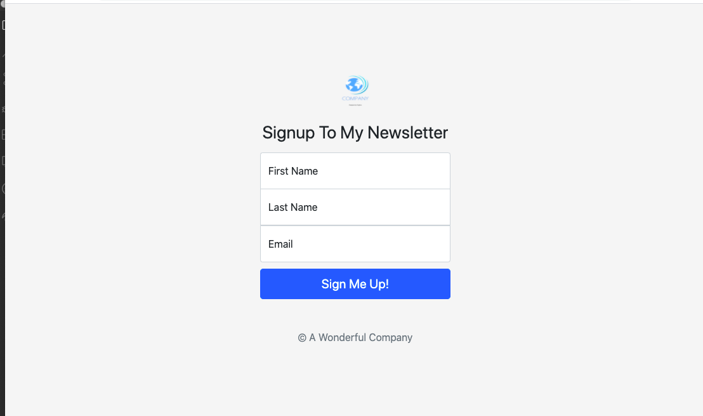
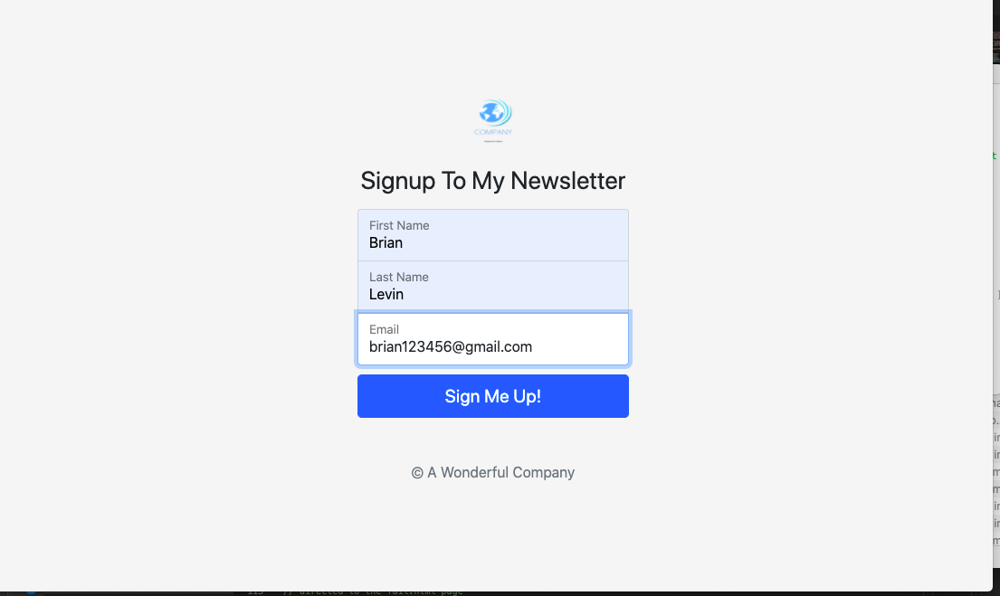
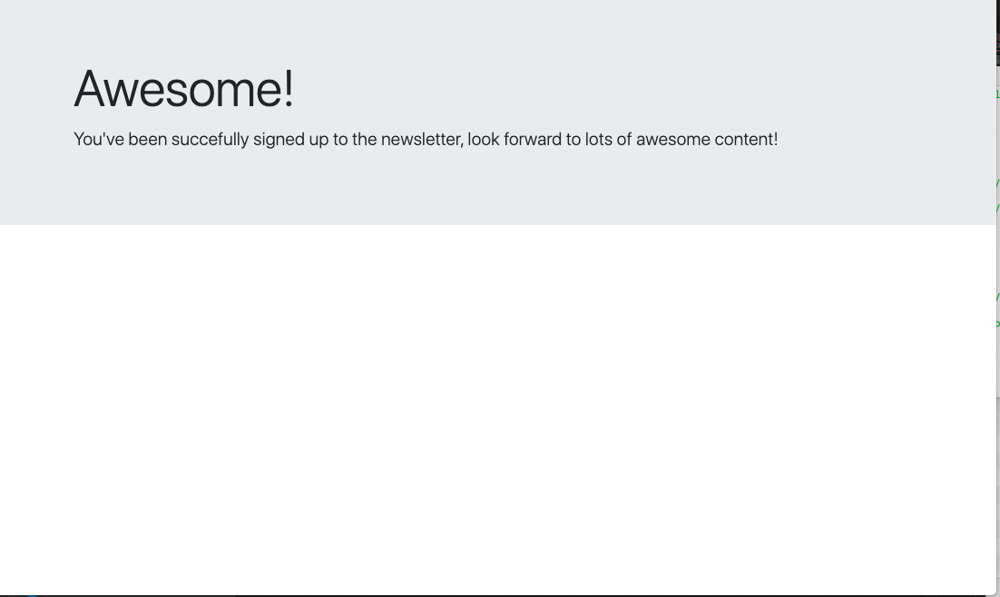
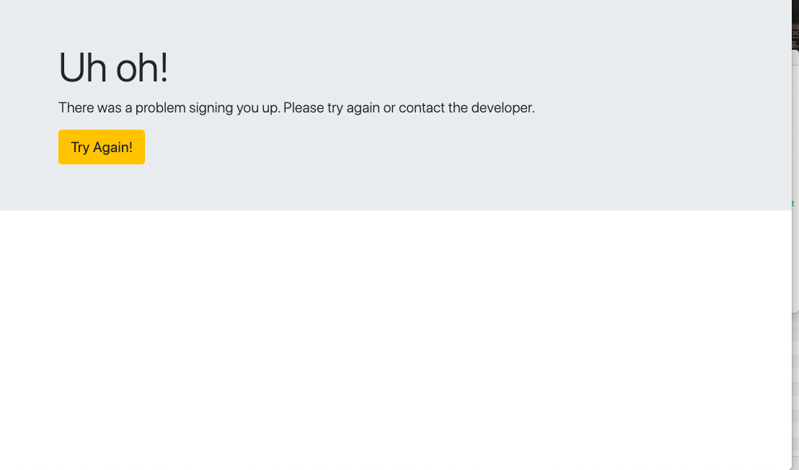
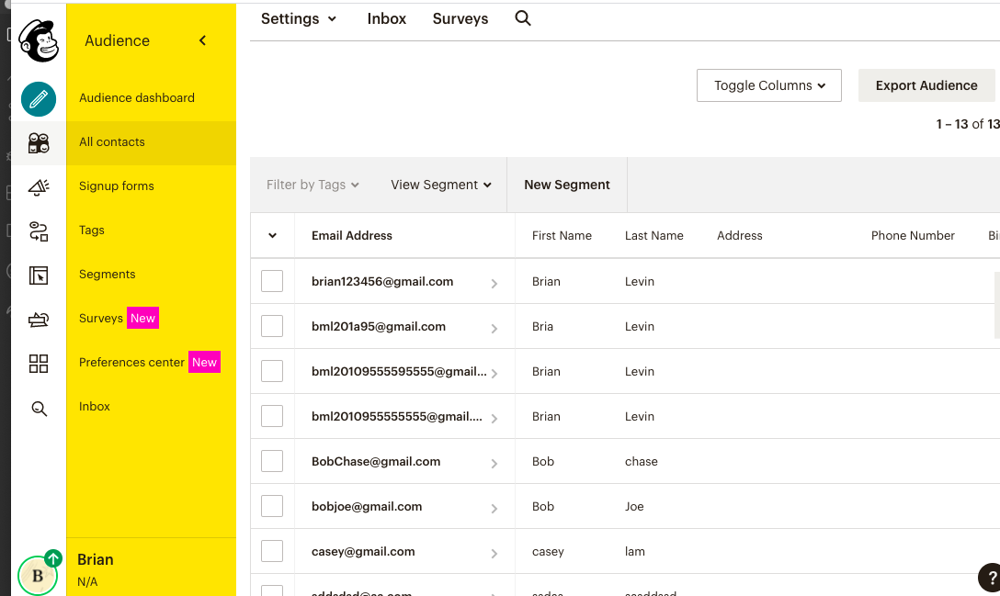

# News-Letter

## Application description:
A  email news letter application that allows the users to sign up for an emailing list through the Mail Chimp API. The user data is then stored on the Mail Chimp websites database where the wwner will  be able to access registered users and send them emails.
 

 ## Click [here](https://news-letter123.herokuapp.com/) for the live app. 
 
 This is  the home page:
 
 
 
 Enter your credentials:
 

  
 A sucess page is then displayed if everything goes through correctly:
 
  
  
  Otherwise, a  failure page will be displayed which will prompt the user to click the button to go back to the homepage:
    
   
   
   Once Sucessful, The user  information will then be saved to the mail chimp database where the website owner can send them emails:
          
      
   Here is an demonstration of how the website works if the user is successful and if the user fails signing up:
   
   ## Click [here](https://drive.google.com/file/d/1qJN5TJQt7IC8g4PvH5oXHvKFLAFcc9LI/view?usp=sharing) To watch video demonstration. 
   
   
## Libraries and Frameworks:

- HTML
- CSS
- Javascript
- Node
- Express
- Mail Chimp API

## Email:

bml201095@gmail.com
